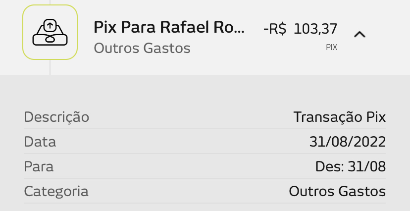

# Anotações das reuniões  

## 2021/08/11  

### Hardware

O orientando tem duas Alex:

- [Echo Dot 3a geração](<https://www.amazon.com.br/Echo-Dot-3ª-Geração-Cor-Preta/dp/B07PDHSJ1H/ref=asc_df_B07PDHSJ1H/?tag=googleshopp00-20&linkCode=df0&hvadid=387692590979&hvpos=&hvnetw=g&hvrand=9214299911360497164&hvpone=&hvptwo=&hvqmt=&hvdev=c&hvdvcmdl=&hvlocint=&hvlocphy=1001698&hvtargid=pla-823375121002&psc=1> "Echo Dot")  
- [Echo Show 5 - Smart Speaker com tela de 5,5](<https://www.amazon.com.br/Echo-Show-Smart-Speaker-Alexa-Branco/dp/B07KD7TD31/ref=p13n_ds_purchase_sim_1p_dp_desktop_2/146-2881225-6209520?pd_rd_w=7heNX&pf_rd_p=bcb2ee29-2818-4fa9-a787-3b071b070ab8&pf_rd_r=RK2YFVX3D06GG6YWWC7V&pd_rd_r=cf0024b5-380c-42de-ac3e-a16c85683707&pd_rd_wg=NAOUN&pd_rd_i=B07KD7TD31&psc=1> "Echo Show")  

Usar o SonOff 4 baias do Dalton.  

### Ideias

Obs.:Tratar todos como protótipos.  

- Alexa Flashcards: Skill da Alexa com sistema de flashcard, onde o usuário poderá cadastrar textos para serem lidos. Podendo relacionar com a metologia de repetição.  
Nome: Flashcards?  

- [x] Alexa improviso, jogo que a cada x segundos será solta uma palavra onde a pessoa terá que continuar a história baseado naquela palavra, desta forma a alexa serve como uma "plateia", podendo ter decks de palavras.
Nome: Galera do Improviso, Improviso de Loci  

- Alexa reciclagem, perguntas e respostas, ou fatos, ou dicas referente a reciclagem -- Podendo incluir flashcards específicos.  
Nome: Ensina&Recicla  
--> Apoio ao ensino de sustentabilidade por meio de assistentes virtuais (Alexa).  

- [x] Alexa jogo da memória, seja físico algo similar ao jogo genius ou apenas fala (podendo ser de perguntas e respostas).  
Título:  

- Alexa escolha a sua história, alexa irá contar uma história e em determinados eventos irá pedir para você escolher o caminho.  

Tema: reciclagem  

Indiquei pesquisar sobre o assunto de Informática na Educação para ter material relacionado ao cenário do TCC em: <https://cbie.ceie-br.org/2020/>. Comentei para olhar em 2020 e 2019.  

## 2022/08/31

Compra de material na Proesi:  

[EquipamentosMiguel](EquipamentosMiguel.pdf "EquipamentosMiguel")  

## 2022-10-13 - 13:12

[2022-10-12_EMail_SaudePai](2022-10-12_EMail_SaudePai.pdf "2022-10-12_EMail_SaudePai")  

## 2022-10-27 - 10:59

[2022_10-27_Monografia.pdf](2022_10-27_Monografia.pdf "2022_10-27_Monografia.pdf")  
[2022_10-27_TutorialAlexa.pdf](2022_10-27_TutorialAlexa.pdf "2022_10-27_TutorialAlexa.pdf")  
[2022_10-27_RelatorioParcial.pdf](2022_10-27_RelatorioParcial.pdf "2022_10-27_RelatorioParcial.pdf")  

## 2022-11-02 - 09:55

[2022-11-01_RelatoriosQuinzenal_eMail.pdf](2022-11-01_RelatoriosQuinzenal_eMail.pdf "2022-11-01_RelatoriosQuinzenal_eMail.pdf")  

## 2022-11-16 - 16:11

[2022-11-13_RelatoriosQuinzenal_eMail.pdf](2022-11-13_RelatoriosQuinzenal_eMail.pdf "2022-11-13_RelatoriosQuinzenal_eMail.pdf")  

## 2022-11-17 - 17:10

[2022-11-17_comandos.docx](2022-11-17_comandos.docx "2022-11-17_comandos.docx")  
[2022-11-17_TCC_FINAL.docx](2022-11-17_TCC_FINAL.docx "2022-11-17_TCC_FINAL.docx")  
[2022-11-17_TCC2_V3.docx](2022-11-17_TCC2_V3.docx "2022-11-17_TCC2_V3.docx")  
[2022-11-17_TutorialAlexa.docx](2022-11-17_TutorialAlexa.docx "2022-11-17_TutorialAlexa.docx")  

## 2022-11-24 - 20:03

[2022-11-24_RelatoriosQuinzenal_eMail.pdf](2022-11-24_RelatoriosQuinzenal_eMail.pdf "2022-11-24_RelatoriosQuinzenal_eMail.pdf")  

## 2022-12-04 - 18:21

Liberei para entrega em TCC2.  
Fazer os slides.  
[2022-12-04_monografia_Dalton](2022-12-04_monografia_Dalton.docx "2022-12-04_monografia_Dalton").  

## 2022-12-05 - 15:43

Entrega da monografia TCC2.  
[2022-12-05_monografia_EntregueTCC2.pdf](2022-12-05_monografia_EntregueTCC2.pdf "2022-12-05_monografia_EntregueTCC2.pdf").  

## 2022-12-12 - 17:05

Prévia da apresentação:  
Duração: 27 min

Gostei quando mencionou a motivação antes dos objetivos.  

Aumentar as figuras.  
No código pode mencionar a borda de cor quando estiver falando.  

Percentuais de que tipo de assistente virtual não batem 100%  
Inverter final da conclusão.  

## 2022-12-14 - 17:11 - Defesa TCC

_ Materiais  
[_reunioes.md](_reunioes.md "_reunioes.md")  
[2022-12-14_Defesa_Mail.pdf](2022-12-14_Defesa_Mail.pdf "2022-12-14_Defesa_Mail.pdf")  
[2022-12-14_Defesa_Monografia.pdf](2022-12-14_Defesa_Monografia.pdf "2022-12-14_Defesa_Monografia.pdf")  
[2022-12-14_Defesa_Slides.pptx](2022-12-14_Defesa_Slides.pptx "2022-12-14_Defesa_Slides.pptx")  
[2022-12-14_Defesa_TutorialAlexa.pdf](2022-12-14_Defesa_TutorialAlexa.pdf "2022-12-14_Defesa_TutorialAlexa.pdf")  

_ Maurício  
[2022-12-14_Ajustes_Mauricio.docx](2022-12-14_Ajustes_Mauricio.docx "2022-12-14_Ajustes_Mauricio.docx")  

_ Aurélio  
[2022-12-14_Ajustes_Aurelio.pdf](2022-12-14_Ajustes_Aurelio.pdf "2022-12-14_Ajustes_Aurelio.pdf")  

Comentários __  
Resultados: texto para uma tabela  
Retirar dos objetivos fazer o tutorial .. levar para o principal.  
Juntar seções pequenas ... CloudWatch etc.  
Rever os requisitos  
Diagrama de Caso de Uso  
Mais quantitativo e menos qualitativo.
Fazer um batimento dos resultados com os objetivos.  
Remover o comparativo e só deixar o Zuffo .. que também usou o Genius, tirar a seção e dissolver na conclusão.  

_ Miguel  
[2022-12-14_Ajustes_Miguel.pdf](2022-12-14_Ajustes_Miguel.pdf "2022-12-14_Ajustes_Miguel.pdf")  

Lembrar que usou lógica zero para ascender a lâmpada.  
Wifi Manager  
Linguagem C do Arduino e não em Linguagem C++
No código marcar qu eé linha.  
